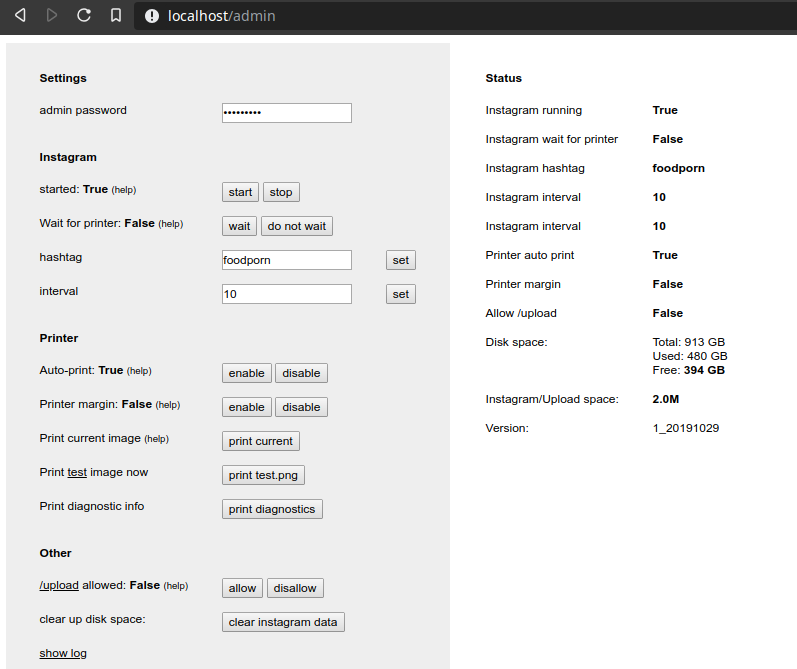

# Shrine
A object for use by the artist duo http://www.frankenrobbert.com to be
integrated into other works

## Physical components
Tested with:
* Raspberry Pi 4 & 3 with Raspbian buster version from [2021-03-04](https://downloads.raspberrypi.org/raspios_armhf/images/raspios_armhf-2021-03-25/2021-03-04-raspios-buster-armhf.zip), previously tested with [2019-09-30](https://downloads.raspberrypi.org/raspbian/images/raspbian-2019-09-30/)
* Also tested with local PC (for USB printers)
* Adafruit ZJ-80 Serial thermal printers
* Cheaper USB thermal printers (e.g. [here](https://www.ebay.de/itm/Excelvan-USB-58mm-Thermal-Dot-Receipt-Printer-Kassendrucker-schwarz-5890K-EU/123901821203?ssPageName=STRK%3AMEBIDX%3AIT&_trksid=p2057872.m2749.l2649))

## Setup

Physically connect printer. For Adafruit or ZJ-80 printer:
- Printer `Black` wire = `GND` to Raspberry Pi pin `6`
- Printer `Yellow` wire = `TX` to Raspberry Pi pin `10`
- Printer `Green` wire = `RX` to Raspberry Pi pin `8`
- Printer `Vcc` Power pin to Raspberry Pi `3.3v` pin `1`
- (more detail at [pinout.xyz](https://pinout.xyz))

Enable serial uart with config menu (_or enable_uart=1 in /boot/config.txt_): 

    raspi-config

Install the ZJ-80 drivers from [Adafruit](https://github.com/adafruit/zj-58) (_or alternative [klirichek](https://github.com/klirichek/zj-58)_):

    sudo apt-get update
    sudo apt-get install -y git cups wiringpi build-essential libcups2-dev libcupsimage2-dev
    git clone https://github.com/adafruit/zj-58
    cd zj-58/ && make && sudo ./install

Test print on Raspberry Pi v4 with serial printer (on v3 change serial0 to ttyAMA0):

    sudo /usr/sbin/lpadmin -p ZJ-58 -E -v serial:/dev/serial0?baud=19200 -P /usr/share/cups/model/zjiang/ZJ-58.ppd

## Start

Copy the config file and change the admin password therein:
    
    cp server.ini.example server.ini

Install required python libraries `web.py` `pycups` `WSGIserver` `instaloader`:

    sudo apt-get install -y python3-
    sudo python3 -m pip install -r requirements.txt

Run start script:

    sudo ./start.sh

Starting as normal user will start server on port 8080, when starting with root the web UI starts on port 80

Access UI:

* ``https://localhost:80/admin`` configure
* ``https://localhost:80/upload`` manually upoad image to print, if enabled
* ``https://localhost:80/`` see downloaded images



To start individual elements instead of using ``start.sh``:

* ``start_printer.sh`` will setup the printer. Setup persists so not required if already setup and configration has not changed. You can just test with: ``echo test | lp -d PRINTER``
* ``start_wifi.sh`` will setup wifi network. Setup persists. Check with ``./status.sh``
* ``sudo python3 server.py``


## Additional setup tips

* ZJ-80 driver options: [Adafruit](https://github.com/adafruit/zj-58) or alternative [klirichek](https://github.com/klirichek/zj-58)

* Test ZJ-80 driver on Linux PC with USB printer:
    
    sudo systemctl start cups
    sudo /usr/sbin/lpadmin -p ZJ-58 -E -v $URI -P /usr/share/cups/model/zjiang/ZJ-58.ppd

* ``start_printer.sh`` for other printer testing and various lp management commands


## Trouble shooting

* [Information about Instagram rate limiting](https://developers.facebook.com/docs/instagram-api/overview/#rate-limiting) -- see also headers server returns on requests. Not sure what the restrictions are for un-registered apps -- 200 requests per hour?
* If issues with python libraries or driver persist, consider downgrading to a Raspbian version that is closer to what this software was originally developed with around the date of 2019-10-29. (such as [2019-07-10](https://downloads.raspberrypi.org/raspbian/images/raspbian-2019-07-12/) or [2019-09-30](https://downloads.raspberrypi.org/raspbian/images/raspbian-2019-09-30/))
* pip install error `fatal error: cups/cups.h: No such file or directory` required installing `sudo apt-get install libcups2-dev`

## Direct interaction

can try various commands found with:
    
    stty -F /dev/serial0 19200
    # print test page works
    echo -en '\x12T' > /dev/serial0
    # Change font settings failed:
    echo -en '\x1D!\x00' > /dev/serial0 # small
    echo -en '\x1D!\x11' > /dev/serial0 # large
    echo -en '\x1B-\x01' > /dev/serial0 # small underline
    echo -en '\x1B@' > /dev/serial0 # reset
    echo "test" | lp -d PRINTER
    # above fails, below works:
    echo -e "test\n\n" > /dev/serial0
    # may have require first sending? '\x1b\x37\x07\xff\x02' which changes heat?
    # Alternatively this also works:
    echo -e "test\n\n\n\n" > /tmp/print && lp -d PRINTER -o raw /tmp/print
    
[More examples](https://github.com/adafruit/Adafruit_CircuitPython_Thermal_Printer/blob/master/adafruit_thermal_printer/thermal_printer.py)


### loss of internet

Added try/except and hope this will no longer crash the instagram thread:

```
connection: [Errno -3] Temporary failure in name resolution')) [retrying; skip with ^C]
JSON Query to explore/tags/goawaysorrowoftheworld/: HTTPSConnectionPool(host='www.instagram.com',port=443): Max retries exceeded with url: /explore/tags/goawaysorrowoftheworld/?__a=1 (Caused byNewConnectionError('<urllib3.connection.VerifiedHTTPSConnection object at 0xb38f62b0>: Failed toestablish a new connection: [Errno -3] Temporary failure in name resolution')) [retrying; skip with ^C]
192.168.0.132:50074 - - [29/Oct/2019 06:07:23] "HTTP/1.1 POST /admin" - 303 See Other
192.168.0.132:50074 - - [29/Oct/2019 06:07:23] "HTTP/1.1 GET /admin" - 200 OK
192.168.0.132:50074 - - [29/Oct/2019 06:07:29] "HTTP/1.1 GET /admin" - 200 OK
JSON Query to explore/tags/goawaysorrowoftheworld/: HTTP error code 500. [retrying; skip with ^C]
Exception in thread Thread-1:
Traceback (most recent call last):
File "/usr/lib/python3.7/threading.py", line 917, in _bootstrap_inner
self.run()
File "/home/pi/shrine_code/web/instagram.py", line 88, in run
self.get_latest_post()
File "/home/pi/shrine_code/web/instagram.py", line 48, in get_latest_post
for post in self._posts:
File "/usr/local/lib/python3.7/dist-packages/instaloader-4.2.9-py3.7.egg/instaloader/instaloader.py", line 833, in get_hashtag_posts
params)['graphql']['hashtag']['edge_hashtag_to_media']
File "/usr/local/lib/python3.7/dist-packages/instaloader-4.2.9-py3.7.egg/instaloader/instaloadercontext.py", line 372, in get_json
raise QueryReturnedNotFoundException("404 Not Found")
instaloader.exceptions.QueryReturnedNotFoundException: 404 Not Found
```
